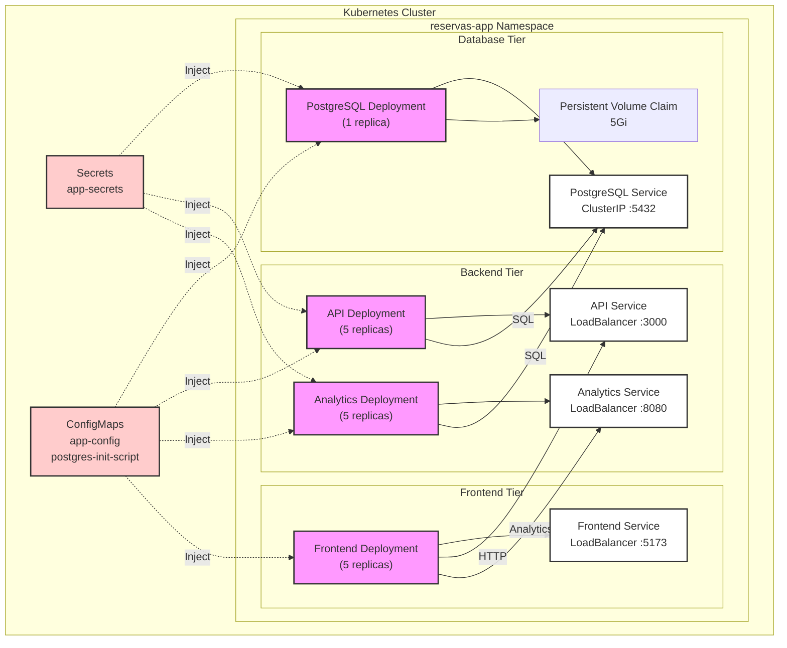

# Sistema de Reservas - Despliegue en Kubernetes (K3s)

Este documento describe el despliegue del sistema de reservas en Kubernetes utilizando K3s, una distribución ligera de Kubernetes.

## Arquitectura del Sistema



## Componentes del Sistema

### Frontend (React + Nginx)

- **Replicas**: 5
- **Puerto**: 5173
- **Recursos**:
  - Requests: 128Mi RAM, 100m CPU
  - Limits: 256Mi RAM, 200m CPU

### Backend API (NestJS)

- **Replicas**: 5
- **Puerto**: 3000
- **Recursos**:
  - Requests: 512Mi RAM, 500m CPU
  - Limits: 1Gi RAM, 1000m CPU

### Analytics (Umami)

- **Replicas**: 5
- **Puerto**: 8080
- **Recursos**:
  - Requests: 256Mi RAM, 250m CPU
  - Limits: 512Mi RAM, 500m CPU

### Base de Datos (PostgreSQL)

- **Replicas**: 1 (stateful)
- **Puerto**: 5432
- **Almacenamiento**: 5Gi PVC
- **Recursos**:
  - Requests: 256Mi RAM, 250m CPU
  - Limits: 512Mi RAM, 500m CPU

## Requisitos Previos

1. K3s instalado:

```bash
curl -sfL https://get.k3s.io | sh -
```

2. kubectl configurado:

```bash
export KUBECONFIG=/etc/rancher/k3s/k3s.yaml
```

## Instrucciones de Despliegue

### 1. Despliegue Automatizado

```bash
# Dar permisos de ejecución
chmod +x deploy-completo.sh

# Ejecutar script de despliegue
./deploy-completo.sh
```

### 2. Despliegue Manual

```bash
# Aplicar todos los manifiestos
kubectl apply -f todos-los-manifiestos.yaml

# Verificar el estado
kubectl get pods -n reservas-app
```

## Monitoreo y Verificación

### Verificar Estado del Sistema

```bash
# Ejecutar script de verificación
chmod +x verificar-estado.sh
./verificar-estado.sh
```

### Comandos de Monitoreo Manual

1. **Ver todos los recursos**:

```bash
kubectl get all -n reservas-app
```

2. **Ver logs**:

```bash
# Logs del API
kubectl logs -f deployment/api -n reservas-app

# Logs de Analytics
kubectl logs -f deployment/analytics -n reservas-app

# Logs del Frontend
kubectl logs -f deployment/frontend -n reservas-app
```

3. **Verificar pods**:

```bash
kubectl get pods -n reservas-app -o wide
```

4. **Estado de servicios**:

```bash
kubectl get svc -n reservas-app
```

## Gestión de Recursos

### Escalar Servicios

```bash
# Escalar API
kubectl scale deployment/api -n reservas-app --replicas=7

# Escalar Frontend
kubectl scale deployment/frontend -n reservas-app --replicas=3
```

### Reiniciar Servicios

```bash
# Reiniciar API
kubectl rollout restart deployment/api -n reservas-app

# Reiniciar Analytics
kubectl rollout restart deployment/analytics -n reservas-app
```

## Backup y Restauración

### Backup de Base de Datos

```bash
kubectl exec -n reservas-app deployment/postgres -- \
pg_dump -U postgres reservas_db > backup.sql
```

### Restaurar Base de Datos

```bash
cat backup.sql | kubectl exec -i -n reservas-app deployment/postgres -- \
psql -U postgres -d reservas_db
```

## Acceso a la Aplicación

1. **Obtener IP del nodo**:

```bash
kubectl get nodes -o wide
```

2. **URLs de acceso**:

- Frontend: `http://<NODE-IP>:5173`
- API: `http://<NODE-IP>:3000`
- Analytics: `http://<NODE-IP>:8080`

## Solución de Problemas

### 1. Problemas de Inicio

```bash
# Ver eventos del sistema
kubectl get events -n reservas-app --sort-by='.lastTimestamp'

# Describir un pod con problemas
kubectl describe pod <pod-name> -n reservas-app
```

### 2. Problemas de Base de Datos

```bash
# Verificar PVC
kubectl get pvc -n reservas-app

# Verificar logs de PostgreSQL
kubectl logs -f deployment/postgres -n reservas-app
```

### 3. Problemas de Conexión

```bash
# Verificar servicios
kubectl get svc -n reservas-app

# Verificar endpoints
kubectl get endpoints -n reservas-app
```

## Mantenimiento

### Actualizar Imágenes

```bash
# Actualizar imagen del API
kubectl set image deployment/api -n reservas-app \
api=arielben75/backend-reservas:latest

# Actualizar imagen del Frontend
kubectl set image deployment/frontend -n reservas-app \
frontend=arielben75/frontend-reservas:latest
```

### Limpiar Recursos

```bash
# Eliminar todo el namespace
kubectl delete namespace reservas-app
```

## Seguridad

Los secretos y configuraciones sensibles están almacenados en:

- Secret: `app-secrets`
- ConfigMap: `app-config`

Para modificar secretos:

```bash
kubectl edit secret app-secrets -n reservas-app
```

## Recursos y Límites

Todos los servicios tienen configurados límites de recursos para garantizar la estabilidad del sistema. Ver la sección "Componentes del Sistema" para detalles específicos.

## Métricas

Para habilitar métricas del cluster:

```bash
kubectl apply -f https://github.com/kubernetes-sigs/metrics-server/releases/latest/download/components.yaml
```

Ver uso de recursos:

```bash
kubectl top pods -n reservas-app
```
