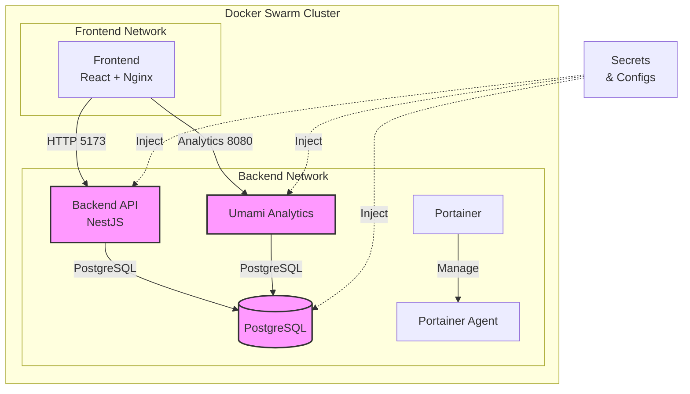

# Sistema de Reservas - Despliegue en Docker Swarm con Secrets

Este documento describe el despliegue seguro del sistema de reservas utilizando Docker Swarm con secretos y configuraciones para un entorno de producción.

## Arquitectura del Sistema



## Componentes y Puertos

| Servicio        | Puerto | Descripción                         |
| --------------- | ------ | ----------------------------------- |
| Frontend        | 5173   | Interfaz de usuario (React + Nginx) |
| Backend API     | 3000   | API REST (NestJS)                   |
| Umami Analytics | 8080   | Análisis de datos                   |
| PostgreSQL      | 5432   | Base de datos (interno)             |
| Portainer       | 9000   | UI de gestión                       |
| Portainer       | 8000   | Túnel de gestión                    |

## Secretos y Configuraciones

### Secrets Requeridos

```bash
# Lista de secrets necesarios
postgres_password     # Contraseña de PostgreSQL
jwt_secret           # Secret para JWT
database_url         # URL de conexión a la BD principal
database_url_umami   # URL de conexión a la BD de Umami
umami_hash_salt      # Salt para Umami
```

### Configs Requeridos

```bash
init_db_v1           # Script de inicialización de BD
umami_entrypoint_v1  # Script de inicio de Umami
```

## Instrucciones de Despliegue

### 1. Preparación del Entorno

Inicializar Docker Swarm si no está activo:

```bash
docker swarm init
```

### 2. Crear Secrets

```bash
# Postgres
echo "PruebasPosgres" | docker secret create postgres_password -

# JWT
echo "q^WUUG7NAex9Da5eT@Y4YKv" | docker secret create jwt_secret -

# Database URLs
echo "postgresql://postgres:PruebasPosgres@db:5432/reservas_db?schema=public" | \
docker secret create database_url -

echo "postgresql://postgres:PruebasPosgres@db:5432/umami_db?schema=public" | \
docker secret create database_url_umami -

# Umami
echo "pruenas_ariel_salt" | docker secret create umami_hash_salt -
```

### 3. Crear Configuraciones

```bash
# Inicialización de BD
docker config create init_db_v1 ./init-db.sh

# Entrypoint de Umami
docker config create umami_entrypoint_v1 ./entrypoint-umami.sh
```

### 4. Desplegar Stack

```bash
docker stack deploy -c stack-deploy-secrets.yml reservas
```

### 5. Verificar Despliegue

```bash
# Listar servicios del stack
docker stack services reservas

# Ver logs de servicios específicos
docker service logs -f reservas_api
docker service logs -f reservas_analytics
docker service logs -f reservas_frontend
```

## Script de Despliegue Automatizado

Se incluye un script `deploy-con-secrets.sh` que automatiza todo el proceso:

```bash
chmod +x deploy-con-secrets.sh
./deploy-con-secrets.sh
```

## Recursos y Límites

### API Backend

- Límites:
  - CPU: 1.0
  - Memoria: 512MB
- Reservaciones:
  - CPU: 0.5
  - Memoria: 256MB

### Analytics (Umami)

- Límites:
  - CPU: 0.5
  - Memoria: 256MB
- Reservaciones:
  - CPU: 0.25
  - Memoria: 128MB

### Frontend

- Límites:
  - CPU: 0.5
  - Memoria: 256MB
- Reservaciones:
  - CPU: 0.25
  - Memoria: 128MB

## Monitoreo y Gestión

### Portainer

- Acceso: http://localhost:9000
- Proporciona interfaz gráfica para:
  - Monitoreo de servicios
  - Gestión de secretos
  - Visualización de logs
  - Gestión de recursos

### Healthchecks

- **PostgreSQL**: Verifica cada 10s
  ```yaml
  test: ["CMD-SHELL", "pg_isready -U postgres"]
  interval: 10s
  timeout: 5s
  retries: 5
  ```

## Comandos Útiles

### Gestión de Stack

```bash
# Desplegar stack
docker stack deploy -c stack-deploy-secrets.yml reservas

# Listar servicios
docker stack services reservas

# Eliminar stack
docker stack rm reservas
```

### Gestión de Secretos

```bash
# Listar secretos
docker secret ls

# Inspeccionar un secreto
docker secret inspect database_url

# Eliminar un secreto
docker secret rm nombre_secreto
```

### Logs y Debugging

```bash
# Ver logs de servicios
docker service logs -f reservas_api
docker service logs -f reservas_analytics

# Estado de los servicios
docker stack ps reservas
```

### Escalar Servicios

```bash
# Escalar un servicio específico
docker service scale reservas_api=3

# Ver distribución de servicios
docker service ps reservas_api
```

## Solución de Problemas

1. **Error de Secrets**

   ```bash
   # Verificar existencia
   docker secret ls
   # Recrear si es necesario
   ./deploy-con-secrets.sh
   ```

2. **Servicios no inician**

   ```bash
   # Ver estado detallado
   docker stack ps reservas --no-trunc
   ```

3. **Problemas de red**
   ```bash
   # Inspeccionar redes
   docker network ls
   docker network inspect reservas_backend
   ```

## Mantenimiento

### Backup de Datos

```bash
# Backup de BD
docker exec $(docker ps -q -f name=reservas_db) \
pg_dump -U postgres reservas_db > backup.sql
```

### Actualización de Imágenes

```bash
# Actualizar imágenes
docker service update --image arielben75/backend-reservas:latest reservas_api
```
