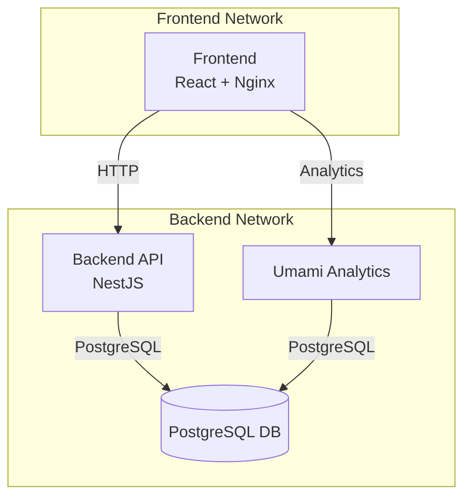
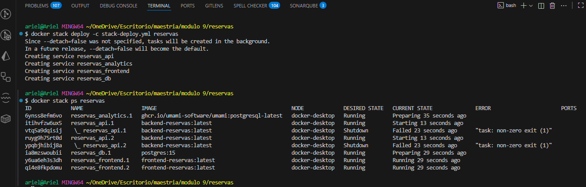
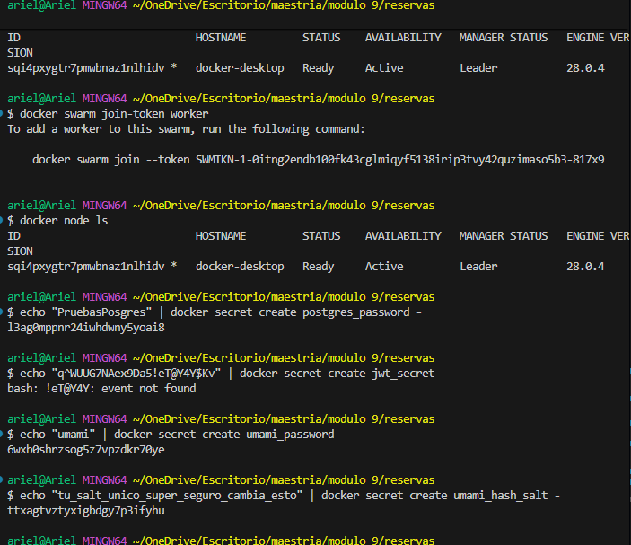

# Sistema de Reservas con Análisis de Datos

Este proyecto implementa una aplicación de reservas completa con análisis de datos integrado utilizando Umami Analytics. La arquitectura está compuesta por múltiples servicios containerizados utilizando Docker y puede ser desplegada tanto en Docker Compose como en entornos orquestados (Swarm/Kubernetes).

## Arquitectura



## Componentes

### Frontend (React + Nginx)

- Interfaz de usuario moderna y responsive
- Integración con Umami Analytics para seguimiento de usuarios
- Servido a través de Nginx en el puerto 5173

### Backend API (NestJS)

- RESTful API con Swagger documentación
- Sistema de autenticación JWT
- Migraciones automáticas con Prisma
- Expuesto en el puerto 3000

### Base de Datos (PostgreSQL)

- PostgreSQL 15
- Múltiples bases de datos:
  - `reservas_db`: Para la aplicación principal
  - `umami_db`: Para analytics

### Analytics (Umami)

- Sistema de análisis de datos privacy-friendly
- Dashboard en tiempo real
- Configuración personalizada
- Accesible en el puerto 8080

## Requisitos Previos

- Docker y Docker Compose
- Git (opcional)
- Al menos 4GB de RAM disponible

## Instrucciones de Despliegue

1. **Clonar el repositorio** (opcional)

   ```bash
   git clone https://github.com/Arielben75/despliege_conteinerizacion.git
   cd despliege_conteinerizacion
   ```

2. **Configurar variables de entorno**

   - Copiar el archivo `.env.example` a `.env` (si existe)
   - Configurar las siguientes variables críticas:
     ```bash
     POSTGRES_PASSWORD=<tu_contraseña_segura>
     JWT_SECRET=<tu_jwt_secret>
     UMAMI_PASSWORD=<contraseña_admin_umami>
     UMAMI_HASH_SALT=<salt_seguro>
     ```

3. **Iniciar los servicios**

   ```bash
   docker-compose up -d
   ```

4. **Verificar el estado de los servicios**

   ```bash
   docker-compose ps
   ```

5. **Inicializar Umami Analytics**
   ```bash
   chmod +x init-umami.sh
   ./init-umami.sh
   ```

## Acceso a los Servicios

- **Frontend**: http://localhost:5173
- **Backend API**: http://localhost:3000
  - Swagger UI: http://localhost:3000/api/docs
- **Umami Analytics**: http://localhost:8080
  - Usuario por defecto: admin
  - Contraseña: definida en UMAMI_PASSWORD

## Monitoreo de Salud

Los servicios incluyen health checks configurados:

- **Base de Datos**: Verifica la conectividad PostgreSQL cada 10s
- **API**: Monitorea el endpoint /health cada 30s
- **Analytics**: Verifica la disponibilidad web cada 10s

## Manejo de Secretos

Para entornos de producción, se recomienda utilizar Docker Secrets:

```bash
echo "tu_contraseña_segura" | docker secret create postgres_password -
echo "tu_jwt_secret" | docker secret create jwt_secret -
echo "tu_contraseña_umami" | docker secret create umami_password -
echo "tu_salt_seguro" | docker secret create umami_hash_salt -
```

## Capturas de Pantalla


_Dashboard de Umami mostrando análisis en tiempo real_


_Documentación interactiva de la API con Swagger UI_

## Solución de Problemas

1. **Los servicios no inician correctamente**

   - Verificar logs: `docker-compose logs -f [servicio]`
   - Asegurar que los puertos no estén en uso
   - Verificar permisos en volúmenes

2. **Error en migraciones de base de datos**

   - Verificar conectividad a PostgreSQL
   - Revisar logs de API: `docker-compose logs api`
   - Ejecutar migraciones manualmente si es necesario

3. **Umami no inicializa**
   - Verificar logs: `docker-compose logs analytics`
   - Asegurar que la base de datos `umami_db` existe
   - Revisar credenciales en variables de entorno

## Mantenimiento

- **Backups de Base de Datos**

  ```bash
  docker-compose exec db pg_dump -U postgres reservas_db > backup.sql
  ```

- **Actualización de Imágenes**
  ```bash
  docker-compose pull
  docker-compose up -d
  ```

## Licencia

[MIT License](LICENSE)

## Contribuciones

Las contribuciones son bienvenidas. Por favor, abrir un issue primero para discutir los cambios propuestos.
